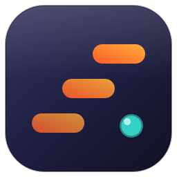

<p align="center">
  
</p>

<h1 align="center">PhotoStep</h1>

<p align="center"><strong>Fast, complete layer-based image editor in pure Rust.</strong><br/>
Non-destructive adjustments, masks, styles, pro tools and real PSD files —<br/>
on the desktop, in the browser, and on the command line.</p>

## Brand

| Token | Value |
|---|---|
| Step Orange (primary) | `#FF5A28` |
| Amber (gradient) | `#FFB03A` |
| Aqua (accent) | `#35D0C5` |
| Ink (surface) | `#14142B` |

The mark — three ascending steps ending in a lens dot — stands for progress:
every edit moves the picture one step forward. The desktop app uses the same
palette (dark ink surfaces, step-orange selection and actions).

## Why PhotoStep is fast

- **Small core:** a handful of modules (`core / ops / io / app`) — builds in seconds.
- **Real parallelism:** every adjustment and filter runs on all cores via `rayon`.
- **Fast Gaussian:** 3× separable box-blur approximation instead of heavy convolution.
- **Fast paths** for plain Normal compositing, no wasted float math.
- **Single texture upload** — the canvas re-uploads only when pixels change, not every frame.

## Features

### Layers, masks, adjustments — non-destructive by default
- Pixel layers + **live adjustment layers** (17 kinds): Brightness/Contrast,
  Levels, **Curves with a draggable editor**, Hue/Saturation/Lightness,
  Vibrance, Exposure, Color Balance, Black & White, Photo Filter,
  Channel Mixer, Gradient Map, Shadows/Highlights, Threshold, Posterize,
  Invert, Grayscale, Auto Contrast
- **Layer masks** (paint black to hide, white to reveal; Image/Mask target toggle)
- **Layer styles**: Drop Shadow, Outer Glow, Stroke — rendered live
- 18 blend modes, opacity, visibility, reorder, duplicate, merge, flatten
- Full **History panel** with labeled steps and click-to-jump

### 15 tools
Move (drag to reposition) · Brush · Eraser · **Clone Stamp** (Alt-click source) ·
Fill · **Gradient** (foreground → background) · Picker · Rectangle / Ellipse
marquee · **Magic Wand** (tolerance + Shift to add) · Rectangle / Ellipse / Line
shapes (own layers) · **Crop** · Zoom

### Selections that work everywhere
Marquee + wand masks with **feathering**, invert, Shift-add, marching-ants-style
highlight — respected by brushes, gradients, fills and **every filter/adjustment**.

### Filters & transforms
Gaussian / Motion / Radial blur, Sharpen (unsharp mask), Median (dust &
scratches), High Pass, Find Edges, Emboss, Pixelate, Noise, Vignette, plus
free **Scale %** and **arbitrary Rotate °** per layer, flips, 90°/180° rotation,
crop to selection.

### Formats
**PSD import** (layers, names, visibility, opacity, blend modes) · PNG, JPEG,
TIFF, BMP, WebP, GIF, QOI · native `.pstep` project files (JSON, keeps layers,
masks, adjustments and styles).

## Getting started

### 1) Install Rust (once)

```powershell
winget install -e --id Rustlang.Rustup
# then close and reopen the terminal
rustup toolchain install stable
```

### 2) Launch the studio

```powershell
cd photostep
cargo run --release
```

### 3) Try it in the browser (web build)

```sh
rustup target add wasm32-unknown-unknown
cargo install trunk --locked
trunk serve   # local preview at http://127.0.0.1:8080
```

Live demo: **https://salim-studio.github.io/photostep/** (auto-deployed from
`main` via GitHub Actions). The web demo starts from a blank canvas; file
open/save needs the desktop build.

### 4) Batch processing (no GUI)

```powershell
cargo run --release -- --input in.psd --out out.png --op "shadowhi:30,10" --op "curves" --op "vignette:0.6"
cargo run --release -- --input photo.jpg --out motion.png --op "motion:25,12" --op "gradmap"
```

Supported ops: `brightness:N contrast:N invert grayscale threshold:N posterize:N
exposure:N vibrance:N saturate:X hue:deg levels:lo,hi[,gamma] curves
colorbal:R,G,B blackwhite photofilter[:N] gradmap shadowhi:S,H blur:R sharpen:A
edge emboss pixelate:N noise:N vignette:X autocontrast motion:A,L radial:N
median:N highpass:N rotate:D scale:X[,Y] fliph flipv rot90`

## Shortcuts

`Ctrl+Z` undo · `Ctrl+Y` redo · `Ctrl+D` deselect · tools: V B E S G I M W C ·
hold `Alt` with Clone to set source, `Shift` with Wand to add, `Shift` with
Zoom to zoom out.

## Architecture

```
src/main.rs  → CLI + native launcher + WASM boot
src/core.rs  → Document / Layer / Mask / Blend / Adjustment / Effects / History + tests
src/ops.rs   → adjustments + filters + selections + transforms (rayon) + tests
src/io.rs    → image + PSD + .pstep project I/O
src/app.rs   → studio UI (tools / canvas / layers / panels / curve editor)
assets/      → brand logo (SVG)
web/         → static web shell (used by Vercel + Pages pipelines)
```

## Honest scope

PhotoStep covers the complete everyday professional workflow: layers, masks,
adjustments, styles, selections, retouching, filters, transforms, PSD and
batch processing. Deliberately out of scope: generative AI fill, 3D, video
timelines, print CMYK separations and 16-bit/channel workflows, plugin APIs,
and pixel-perfect PSD round-tripping of text/shape/smart objects (they import
as rendered pixels).

## Roadmap

- Drag & drop + file picker for the web build
- Tile-based copy-on-write storage for huge (8K+) canvases
- GPU compositing via `wgpu`
- Stylus pressure + adjustment-layer clipping masks

## License

MIT — see [LICENSE-MIT](LICENSE-MIT).

© 2026 salim-slimani. All rights reserved.
